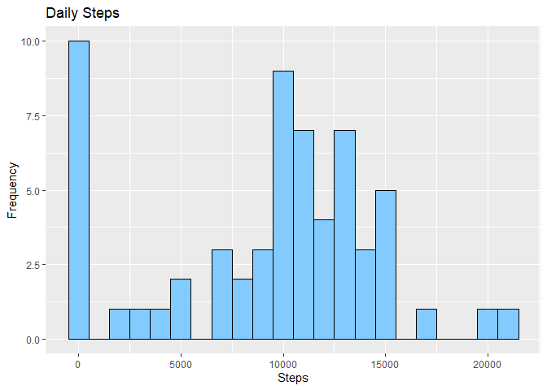
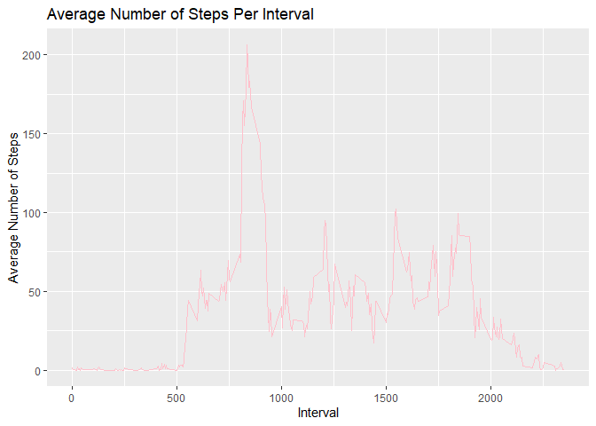
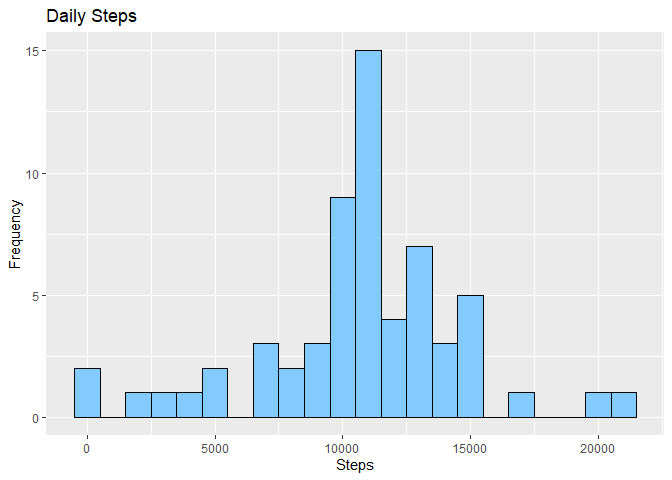
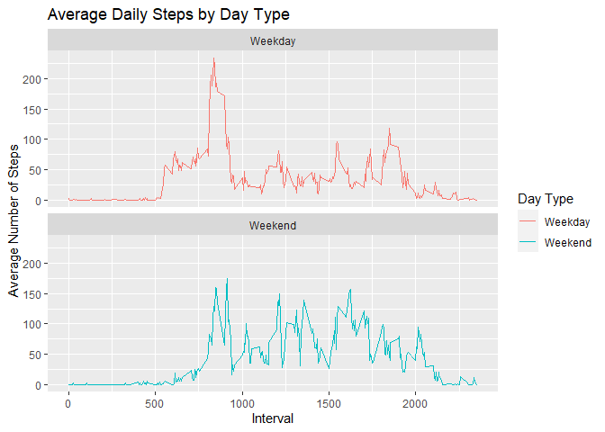

#Introduction 
It is now possible to collect a large amount of data about personal movement using activity monitoring devices such as a 
Fitbit, Nike Fuelband, or Jawbone Up.These type of devices are part of the “quantified self” movement – a group of enthusiasts who take measurements about themselves regularly to improve their health, to find patterns in their behavior, or because they are tech geeks. But these data remain under-utilized both because the raw data are hard to obtain and there is a lack of statistical methods and software for processing and interpreting the data.

This assignment makes use of data from a personal activity monitoring device. This device collects data at 5 minute intervals through out the day. The data consists of two months of data from an anonymous individual collected during the months of October and November, 2012 and include the number of steps taken in 5 minute intervals each day.

The data for this assignment can be downloaded from the course web site:

Dataset: [Activity monitoring data](https://d396qusza40orc.cloudfront.net/repdata%2Fdata%2Factivity.zip)
 

The variables included in this dataset are:

 - *steps*: Number of steps taking in a 5-minute interval (missing values are coded as NA)

 - *date*: The date on which the measurement was taken in YYYY-MM-DD format

 - *interval*: Identifier for the 5-minute interval in which measurement was taken

## Loading and preprocessing the data
File was downloaded and unzipped manually

```r
library(readr)
library(ggplot2)
activity <- read_csv("activity.csv")
```

```
## Rows: 17568 Columns: 3
## ── Column specification ────────────────────────────────────────────────────────
## Delimiter: ","
## dbl  (2): steps, interval
## date (1): date
## 
## ℹ Use `spec()` to retrieve the full column specification for this data.
## ℹ Specify the column types or set `show_col_types = FALSE` to quiet this message.
```

```r
#Formating date
activity$date<- as.POSIXct(activity$date, "%Y%m%d")
days<- weekdays(activity$date)
```

```
## Warning in as.POSIXlt.POSIXct(x, tz): unknown timezone '%Y%m%d'
```

```r
#Adding column with weekdays to activity
activity<- cbind(activity,days)
```
## What is mean total number of steps taken per day?
Calculating the total number of steps per each day

```r
totalsteps<- with(activity, aggregate(steps, by = list(date), sum, na.rm=TRUE))
```

```
## Warning in as.POSIXlt.POSIXct(x): unknown timezone '%Y%m%d'

## Warning in as.POSIXlt.POSIXct(x): unknown timezone '%Y%m%d'
```

```r
colnames(totalsteps)<- c("Date", "Steps")
```
Plotting the total number of steps each day

```r
ggplot(totalsteps, aes(x = Steps)) +
  geom_histogram(fill = "#83CAFF", col = "black", binwidth = 1000) +
  labs(title = "Daily Steps", x = "Steps", y = "Frequency")
```

<!-- -->
Calculate the mean and median  total number of steps taken per day

```r
mean(totalsteps$Steps)
```

```
## [1] 9354.23
```

```r
median(totalsteps$Steps)
```

```
## [1] 10395
```
## What is the average daily activity pattern?
Make a time series plot (i.e. type = "l") of the 5-minute interval (x-axis) and the average number of steps taken, averaged across all days (y-axis)

```r
averageDailyActivity<- with(activity, aggregate(steps, by=list(activity$interval), FUN = mean, na.rm=TRUE))
colnames(averageDailyActivity)<- c("Interval", "Mean")
averageActivitydf <- data.frame(averageDailyActivity)
#Plotting
ggplot(averageDailyActivity, aes(x=Interval, y=Mean))+
  geom_line(col = "pink") +
  xlab("Interval") + 
  ylab("Average Number of Steps") + 
  ggtitle("Average Number of Steps Per Interval")
```

<!-- -->
Which 5-minute interval, on average across all the days in the dataset,contains the maximum number of steps?

```r
averageDailyActivity[which.max(averageDailyActivity$Mean), ]$Interval
```

```
## [1] 835
```
## Imputing missing values
Calculate and report the total number of missing values in the dataset

```r
sum(is.na(activity$steps))
```

```
## [1] 2304
```
Devise a strategy for filling in all of the missing values in the dataset.

```r
imputedSteps <- averageDailyActivity$Mean[match(activity$interval, averageDailyActivity$Interval)]
```
Transforming steps in activity if they were missing values with the filled values from above.

```r
activityImputed <- transform(activity, 
                             steps = ifelse(is.na(activity$steps), yes = imputedSteps, no = activity$steps))
```
 # Forming the new dataset with the imputed missing values.

```r
totalActivityImputed <- aggregate(steps ~ date, activityImputed, sum)
```

```
## Warning in as.POSIXlt.POSIXct(x): unknown timezone '%Y%m%d'

## Warning in as.POSIXlt.POSIXct(x): unknown timezone '%Y%m%d'
```

```r
names(totalActivityImputed) <- c("date", "dailySteps")
#Plotting
ggplot(totalActivityImputed, aes(x = dailySteps)) +
  geom_histogram(fill = "#83CAFF", col = "black", binwidth = 1000) +
  labs(title = "Daily Steps", x = "Steps", y = "Frequency")
```

<!-- -->

```r
mean(totalActivityImputed$dailySteps)
```

```
## [1] 10766.19
```

```r
median(totalActivityImputed$dailySteps)
```

```
## [1] 10766.19
```

## Are there differences in activity patterns between weekdays and weekends?
updating format of dates

```r
activity$date <- as.Date(strptime(activity$date, format="%Y-%m-%d"))
```

```
## Warning in as.POSIXlt.POSIXct(x): unknown timezone '%Y%m%d'
```
function that recognises weekend over weekday

```r
activity$dayType<- sapply(activity$date, function(x){
  if(weekdays(x)== "Saturday"| weekdays(x)== "Sunday")
  {y<- "Weekend"}
  else {y<-"Weekday"}
  y
})
activityByDay <-  aggregate(steps ~ interval + dayType, activity, mean, na.rm = TRUE)
#Plotting
dayPlot <-  ggplot(activityByDay, aes(x = interval , y = steps, color = dayType)) + 
  geom_line() + ggtitle("Average Daily Steps by Day Type") + 
  xlab("Interval") + 
  ylab("Average Number of Steps") +
  facet_wrap(~dayType, ncol = 1, nrow=2) +
  scale_color_discrete(name = "Day Type") 
print(dayPlot) 
```

<!-- -->
